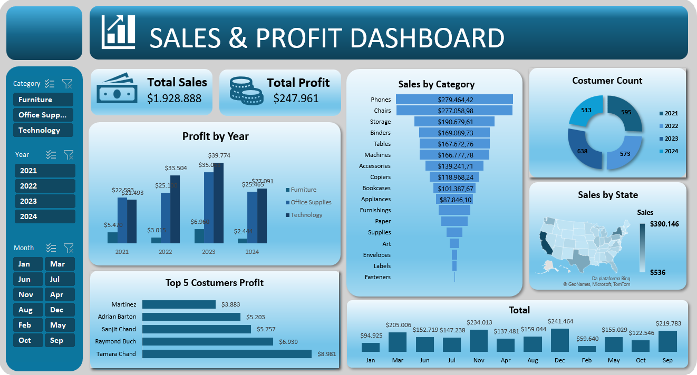
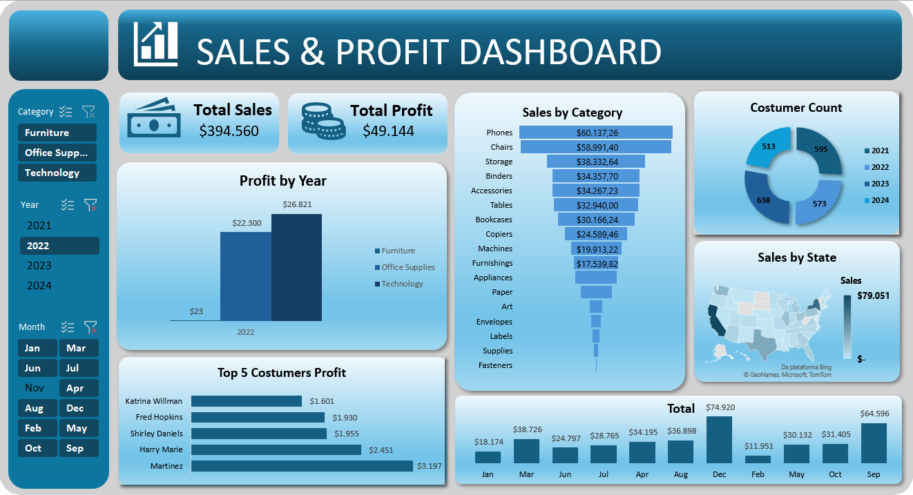

# 📊 Dashboard de Vendas

Dashboard de vendas desenvolvido no **Microsoft Excel**, utilizando **tabelas, tabelas dinâmicas e visualizações de dados** para análise dos principais indicadores comerciais.

O projeto apresenta informações sobre vendas, clientes, lucro, desempenho mensal e distribuição das vendas por estado.

## 📷 Dashboard

 

## 🛠️ Tecnologias

- Python
- Excel
- Tabelas Dinâmicas
- Visualização de Dados

## 🎯 Objetivo

Apresentar os principais indicadores comerciais de forma visual, facilitando a análise de vendas, clientes, lucro e desempenho por região e período.
